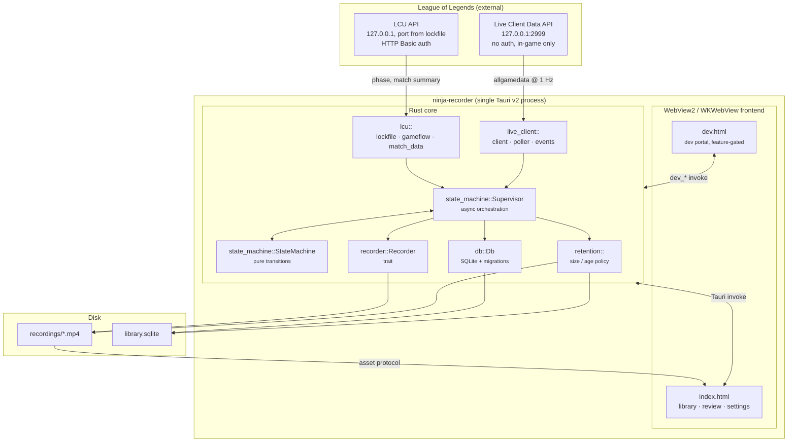
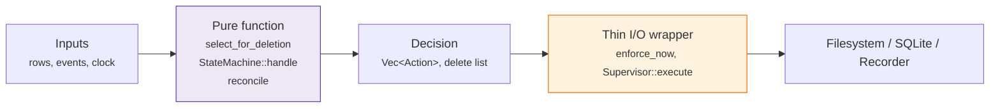
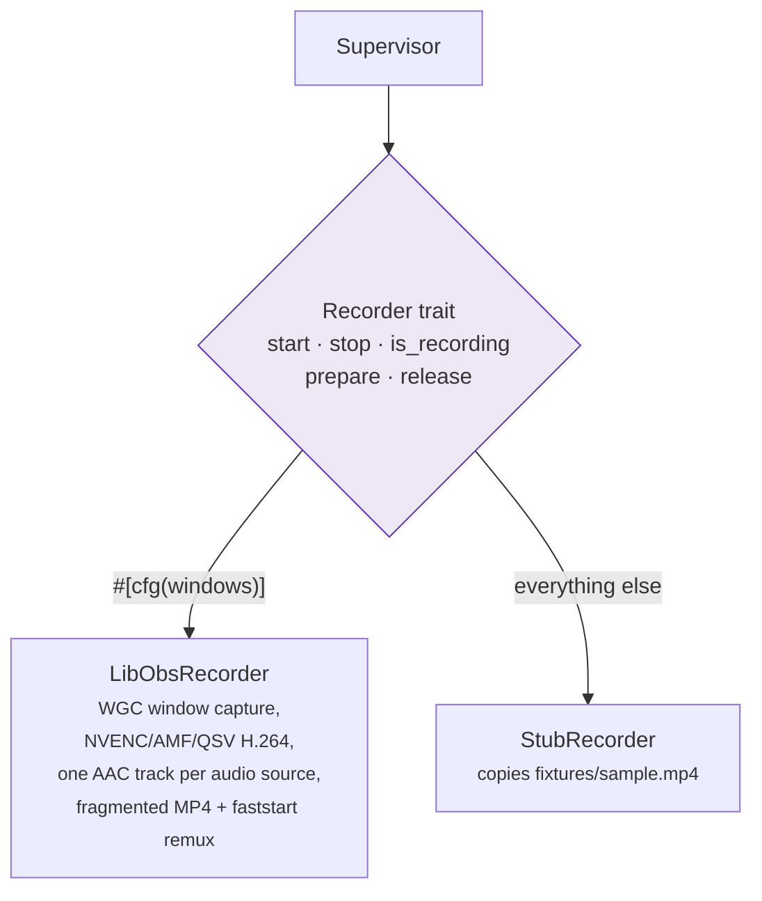
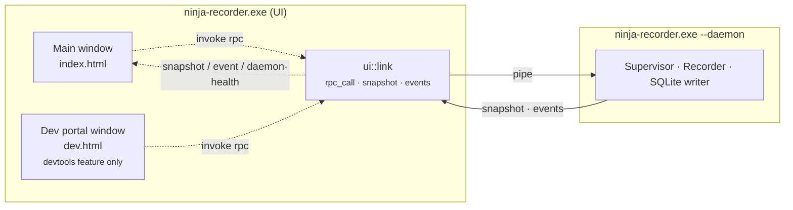
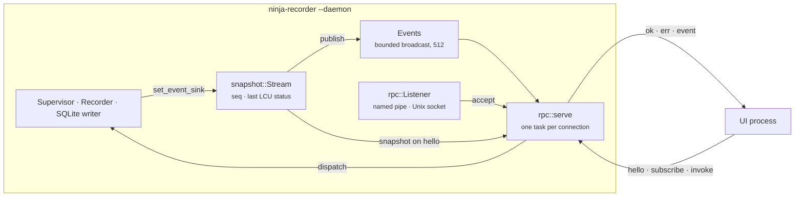

# Architecture

How the pieces fit together, what owns what, and where a given behaviour
lives in the tree. Start here; [recording-pipeline.md](recording-pipeline.md)
then walks the runtime path end to end.

For the *reasoning* behind these choices: why libobs, why no injection, why
Tauri: read [DEVELOPMENT.md](../DEVELOPMENT.md). This file describes the
shape; that one defends it.

---

## The whole system at a glance

One process, two windows, three external interfaces (two local HTTP APIs and
the filesystem).

## Rust module map

| Module | Owns | Key entry points |
|---|---|---|
| `lcu/lockfile.rs` | Finding the running client and its credentials | `discover`, `watch` |
| `lcu/gameflow.rs` | Phase changes (WebSocket, polling fallback), and which game is running | `watch`, `fetch_session` |
| `lcu/match_data.rs` | Post-game summary from the end-of-game block, then match history (win, KDA, champion id, queue, role, patch) | `fetch_match_summary` |
| `lcu/champions.rs` | Champion id → display name, from the client's asset store, cached per client session | `champion_name` |
| `lcu/client.rs` | HTTPS + Basic auth against the client's self-signed cert | `LcuHttpClient` |
| `live_client/client.rs` | Port 2999 HTTPS client | `fetch_all_game_data` |
| `live_client/poller.rs` | 1 Hz poll loop with exponential backoff (cap 10 s) | `watch` |
| `live_client/events.rs` | Snapshot → markers, team-advantage samples, the match summary, video-time alignment | `MarkerTracker`, `TimeAlignment`, `team_diff`, `self_summary` |
| `state_machine/machine.rs` | The pure `(state, event) → (state, actions)` function | `StateMachine::handle` |
| `state_machine/supervisor.rs` | Spawning/aborting watchers, driving the recorder, finalizing | `Supervisor` |
| `recorder/mod.rs` | The `Recorder` trait and its config/error types | `Recorder`, `RecordConfig` |
| `recorder/libobs/` | Windows capture backend (WGC + hardware encode) | `LibObsRecorder` |
| `recorder/stub.rs` | Non-Windows dev backend that copies a fixture MP4 | `StubRecorder` |
| `ddragon.rs` | Champion art from Data Dragon, fetched on first use and cached on disk | `champion_icon` |
| `db/mod.rs` | Schema, migrations, every query | `Db` |
| `db/reconcile.rs` | Reconciling DB rows against files on disk | `reconcile` |
| `probe.rs` | Reading a container's duration back out with ffmpeg, for files `reconcile` imported | `duration_s` |
| `match_summary.rs` | Waiting out the LCU after a finalize, then patching the row with what it eventually says | `patch`, `next_delay` |
| `retention.rs` | Deletion policy and free-space preflight | `select_for_deletion`, `enforce_now`, `has_room_to_record` |
| `log.rs` | The log file under `app_data_dir()/logs/`, which is `ui.log` or `daemon.log` depending on which process is writing, kept in release builds too, and the `error!`/`warn!`/`info!`/`debug!` macros everything else writes through | `init`, `write`, `Process` |
| `fixtures.rs` | Capturing live API responses to `fixtures/` | `enabled`, `record` |
| `dev/` | Dev portal backend, compiled out without `--features devtools` | `dev_*` commands |
| `dev/dispatch.rs` | Name-and-JSON dispatch over the `dev_*` commands that run in the daemon | `dispatch_dev`, `is_async_dev_command` |
| `core/mod.rs` | Every command's logic, with no `tauri` types in any signature | `Ctx`, the command free functions |
| `launch.rs` | Which mode argv asked for (`--daemon`, `--hidden`), and the flag constants autostart registers | `Launch::from_env`, `HIDDEN_FLAG` |
| `daemon/mod.rs` | The headless process: paths without an `AppHandle`, the startup and shutdown order, and everything the UI's `setup` does minus the window | `run`, `Paths`, `IDENTIFIER` |
| `daemon/rpc.rs` | The wire protocol, the endpoint's name, the listener that owns it, and the client's way in | `serve`, `endpoint`, `Listener`, `connect` |
| `daemon/snapshot.rs` | The event stream's position and the state a `hello` is answered with | `Stream`, `Stream::source` |
| `daemon/spawn.rs` | Connecting to the daemon, and starting one when nothing answers | `connect_or_start` |
| `ui/client.rs` | The UI's side of the pipe: reply routing, reconnect, version-skew refusal | `spawn`, `Client` |
| `ui/link.rs` | That client hung off a Tauri app: the `rpc_call` proxy, and the daemon's pushes re-emitted to the webview | `attach`, `rpc_call`, `rpc_subscribe` |
| `tray.rs` | The tray icon and its Open / Settings / Quit menu. No tests, deliberately | `build`, `request_quit` |
| `notify.rs` | Desktop notifications, best-effort. No tests, deliberately | `notify`, `close_to_tray_notice` |
| `lib.rs` | Tauri setup, app state, the `rpc` command, and main-window creation | `run` |

`core` exists because Tauri v2 cannot invoke a registered command by name from
Rust, so a windowless recorder daemon could not reuse `#[tauri::command]`
functions at all ([DEVELOPMENT.md §12](../DEVELOPMENT.md#12-process-model-a-recorder-daemon-and-a-ui-that-can-leave)).
`AppState` is a newtype that `Deref`s to `core::Ctx`. Two commands stay in
`lib.rs` rather than moving down: `open_recordings_folder` and
`dev_open_portal`: because they drive the desktop shell.

Anything `core` needs that only an `AppHandle` can do crosses the same way: a
trait object or a closure held by `Ctx` and installed from `lib.rs`'s `setup`.
There are two: `set_library_changed_notifier` (emitting the Tauri event) and
`set_autostart` (the `Autostart` trait over `tauri-plugin-autostart`). Both are
`None` in a unit test, which for autostart is load-bearing: `cargo test` has no
way to write a real login entry. The daemon fills the first with a publish onto
the wire instead of a Tauri emit, which is what those seams were shaped for, and
leaves the second unset until 3.5 moves autostart out of the UI.

The consistent shape across `state_machine`, `db::reconcile` and `retention`
is **a pure decision function plus a thin I/O wrapper**. The decision is unit
tested directly; the wrapper is deliberately kept too small to hide a bug.

## The `Recorder` trait boundary

Capture is the only genuinely platform-specific part of the app, so it sits
behind a three-method trait and nothing above it knows libobs exists.

The stub is not a mock: it writes a real, playable file into the real
recordings directory and takes a real amount of time to do it. That is what
keeps the library, retention, review player and the whole state machine
developable away from Windows, with no Windows box in the loop.

`prepare`/`release` exist because the Windows backend is expensive to hold:
bringing it up spawns the out-of-process worker *and* initializes libobs, so a
warm backend is a GPU device and every plugin resident in another process. The
supervisor warms it when the League client appears and drops it when the client
goes away, off the resulting state rather than off individual actions
([DEVELOPMENT.md §2.2](../DEVELOPMENT.md#22-the-recorder-trait)). Both default
to no-ops, so `StubRecorder` ignores them entirely.

`start` takes the user's audio preset and `stop` reports the track layout it
actually wrote: reported, not assumed, because a microphone can be unplugged
mid-game and the library row has to describe the file that exists
([DEVELOPMENT.md §2.5](../DEVELOPMENT.md#25-multi-track-audio)). Both types are
plain Rust in `recorder/audio.rs`; the libobs vocabulary stops at
`to_obs_tracks`, so nothing above the trait grows a libobs dependency.

## Frontend

Vanilla TypeScript, no framework, split by **state ownership** rather than by
widget: see [frontend.md](frontend.md) for the module graph and the IPC
surface.

## Process and window model

Since WS3.4 the window is a client. `invoke('rpc', ...)` reaches `ui::link`,
which forwards the name and arguments over the pipe and returns what the daemon
answered; nothing the frontend sends changed shape, which is what let every view
survive the move. In the other direction the daemon pushes: a snapshot on every
handshake and a stream of events after it, re-emitted to the webview as
`snapshot`, `event` and `daemon-health`.

**What the UI process no longer does.** It builds no capture backend, starts no
supervisor, runs no lockfile or gameflow watch, and performs no startup
reconcile or retention pass. Those all write or record, and both belong to the
process that outlives the window. Killing the UI now stops nothing.

The main window is built in `lib.rs`'s `setup` rather than declared in
`tauri.conf.json`, whose `app.windows` is empty: Tauri creates config windows
automatically before `setup`, and a `--hidden` start needs to create none at
all ([DEVELOPMENT.md §12](../DEVELOPMENT.md#12-process-model-a-recorder-daemon-and-a-ui-that-can-leave)).

### The daemon, and what of it exists

WS3 splits that one process in two. The daemon now runs: `--daemon` opens the
library, brings up the supervisor and the capture backend, binds the endpoint
and serves clients until it is asked to stop. The tray and its message pump
(3.3), autostart (3.5), the updater (3.6) and the dev portal's commands (3.7)
are not in it yet. Nothing starts it automatically either: `daemon/spawn.rs`
knows how to, but the Run key still launches the UI and the UI still holds a
supervisor of its own. [DEVELOPMENT.md §12](../DEVELOPMENT.md#12-process-model-a-recorder-daemon-and-a-ui-that-can-leave)
says what has to be true before that changes.

**Startup order, and why it is that order.** The endpoint is bound before
anything else is opened, because binding it is also the single-instance check:
a second `--daemon` finds it owned and exits 0 without having touched the log
or the database. Only then does the daemon open `daemon.log`, open the library,
run the startup reconcile and retention passes, start the supervisor, and begin
accepting. Shutdown reverses it: stop accepting, publish `DaemonShuttingDown`,
then finalize whatever recording is in flight, because a game is worth more
than a fast exit.

**One endpoint, no separate mutex.** `rpc::Listener::bind` returns
`Ok(None)` when a daemon already owns the address: `first_pipe_instance` says so
on Windows, and on Unix a failed `bind` followed by a probe distinguishes a live
daemon from a socket file its owner left behind. The address itself is
`rpc::endpoint`, scoped by build identity, because a devtools build and a
release build share `app_data_dir()` and must not also share a pipe.

**No Tauri in the daemon.** It builds no `App`, so `daemon::Paths::resolve`
answers what the UI asks an `AppHandle`: `dirs::data_dir()` joined with the
identifier, which is what Tauri's own `app_data_dir()` does, and the executable's
directory for bundled resources. `daemon::IDENTIFIER` is checked against
`tauri.conf.json` by a test, because a mismatch would not crash. It would give
the daemon a different database in a different folder and have it record
perfectly into a library the UI cannot see.

| Frame | Direction | Carries |
|---|---|---|
| `hello` | in | protocol version; must come first |
| `subscribe` | in | the topics this session wants, replacing what it had |
| `invoke` | in | a command name and its args, with an id |
| `hello` | out | the daemon's protocol version |
| `ok` / `err` | out | the reply, echoing the request's id |
| `event` | out | a contract event, with no id because nothing asked for it |

**It is generic over the stream, and that is the point.** Production is a
Windows named pipe and a Unix socket on a dev box; the tests drive the same
`serve` over a loopback socket in milliseconds, and over the real endpoint on
whichever platform they run. A protocol exercised only on the Windows box is one that gets
tested once a week, and the transport is the one part of the daemon that can be
checked honestly without Windows. Loopback rather than a Unix socket so the
tests also run in CI, which is Windows-only; one Unix-socket test is kept to
prove `serve` really is generic.

The reasoning behind the framing, the per-request ids, the bounded broadcast and
the version refusal is in
[DEVELOPMENT.md §17](../DEVELOPMENT.md#17-contract-and-transport).

Neither child process the app spawns shows a window of its own: the fork
builds `extprocess_recorder.exe` as a Windows-subsystem binary for release,
and every launch of the bundled ffmpeg goes through `lib.rs`'s
`ffmpeg_command`, which sets `CREATE_NO_WINDOW`
([DEVELOPMENT.md §2.2](../DEVELOPMENT.md#22-the-recorder-trait)).

Both windows talk to the same Rust state and the same database. The dev
portal is a second Vite entry point gated on the `NINJA_DEVTOOLS` env var and
a second command set gated on the `devtools` Cargo feature: a plain
`npm run build` cannot emit it, and a default `cargo build` cannot register
its commands. See [dev-portal.md](dev-portal.md).
