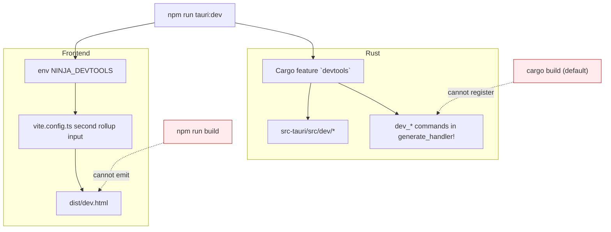

# Dev portal

A second window (`dev.html`) that exercises the whole backend: every command,
every table, the retention decision, and the state machine: none of which the
app's own UI can reach.

Most of the backend can only be driven through it. If you are working on the
supervisor, the DB, retention or the review player, this is your loop.

```bash
npm run tauri:dev   # note the colon; plain `tauri dev` omits the feature
```

`tauri:dev` passes `--features devtools`. Without it the portal's window and
every `dev_*` command are absent, and the main window hides its own "Dev
portal" button accordingly.

---

## It is compiled out of shipped builds

Two independent gates, both off by default:



**Availability is detected, not configured.** The main window calls
`dev_open_portal` and hides its button when the command isn't registered, so
there is no second frontend flag that could drift from the Rust side.

**It is never attached to a release.** It carries raw SQL execution, arbitrary
row writes, a database wipe and state-machine injection: none of which has
any business in a public download. It was once attached to the release with a
note reminding whoever published it to delete the asset first; a reminder is
one forgotten click from shipping all of that, so the asset is now simply
never there. CI uploads it as a workflow artifact instead, which
expires on its own and cannot be published by accident.

## How a panel is mounted

A panel is a plain object with `mount(root, ctx)` and an optional `unmount`.
`mount` is called again on every navigation and on every `ctx.refresh()`: the
`r` key, a `library-changed` event, and several panels' own buttons, so it has
to be safe to run repeatedly.

**Each mount gets a fresh `#dev-main`.** Panels bind delegated handlers to the
element they are handed and have no way to unbind them; `unmount` is not given
a reference to it. Mounting onto the same element every time therefore stacked
one handler per mount, and two live handlers turn a single click into two
toggles: a no-op that renders once on the way through, which is what made the
Log panel's tag chips light up and revert within a frame. Handlers left behind
by *other* panels are the worse half: `[data-reload]` and `[data-copy]` are not
unique across the panel set. `mountPanel` replaces the element with a shallow
clone of itself, which carries the id, class and tabindex and no listeners, so
no panel has to know any of this.

## Panels and what each one exists to solve

| Panel | Exists because |
|---|---|
| **Overview** | The state machine diagram with the live state lit, plus `dev_session_snapshot`: markers and samples accumulating *during* a recording were previously invisible, since `game_state_status` only carries the last finalized one |
| **Seed** | There was no seed script anywhere, so the library, its filters and sort, retention and the entire review player could only be exercised by finishing a real game on Windows. Writes real files, rows, markers with the payload shapes `classify_event` produces, and a 1 Hz advantage curve |
| **Simulate** | The supervisor's async glue was only drivable by real League polling. Dispatches `StateEvent`s into the live supervisor (really starting and stopping the recorder), injects Live Client Data payloads through the real `MarkerTracker`, and replays a scripted game at a speed multiplier until it finalizes into a real row. Its League API probes cover the paths that need a running client: `dev_lcu_get` for any raw endpoint, `dev_champion_name` for the asset-store lookup as the code actually performs it, `dev_fetch_match_summary` for one un-retried post-game fetch, and `dev_patch_match_summary` for the whole deferred patch: retry schedule, `UPDATE` and all: against a recording already in the library, without playing a game first |
| **Retention** | `set_retention_policy` saves *and* enforces, with no preview. `select_for_deletion` is pure and takes an injected clock, so this panel dry-runs it: including at a fabricated "now", to test an age rule without waiting days |
| **Database** | Schema browse, paged table reads, row insert/update/delete, raw SQL, full reset |
| **Commands** | Every registered command, invocable by hand, with a drift banner (below). Also the only home of `dev_trim_lead_in` (below), which is a one-off per recording rather than a workflow worth a panel |
| **Recorder** | `start_recording` / `stop_recording` / `is_recording` directly, without a game |
| **Fixtures** | Read/write `fixtures/`, toggle live capture at runtime: the replay mode the fixture strategy always called for. Capture is **on by default until v1.0** (DEVELOPMENT.md §3.3), so this panel is now mostly for turning it *off*. Also home to the **LCU event recorder**: `dev_event_capture_start` writes every WebSocket frame the client emits to a JSONL file, unfiltered, and `dev_event_uris` says which endpoints appeared so a capture can be searched rather than read. Unfiltered is the point \u2014 a URI filter presupposes knowing which endpoint carries what you are hunting, and it was built for the opposite case: #149 needs an LP change that the end-of-game block does not carry and neither ranked endpoint reports, while the client plainly knows it. A listed fixture opens into a textarea, and from there into the OS's own editor \u2014 the captured `eog-stats-block` is 99 KB of nested JSON and a 16-row textarea is not a way to read it. Also home to `dev_shape_report`, which reads those captures back and says what the parser did *not* understand: event names with no `classify_event` arm, events it could not deserialize at all: reported with the JSON that broke them, which is the thing the `debug!` line used to throw away: fields that arrived as the wrong JSON type, keys on events that nothing reads, and files that are not JSON at all. The mistyped-field check earned itself on the first real capture: `Stolen` arrives as the string `"False"` six times, absorbed by `flexible_bool` and reported nowhere until now. Those first two are the whole diagnosis between them: an event that parsed and classified to nothing and an event that never parsed both show up as a missing marker and want opposite fixes. Capture had been write-only: every shape bug so far (`HordeKill`, the payload behind #74) was sitting in a captured file before anyone knew, because nothing ever looked. A **report, not a validator**: the parser's leniency is deliberate and nothing here changes what it accepts |
| **Library** | One recording from every source that knows something about it (#99). The row including columns the UI never renders, **where each value came from**, marker and sample counts with gold counted apart, the alignment offset, and the scoreboard and diagnostics parsed. Also asks the client, on demand: `dev_recording_vs_lcu` runs the same one-shot `fetch_match_summary` the deferred patch uses and lays its answer beside the row, field by field, leading with a count of what disagrees. Two views of one match should never differ, so a disagreement almost always means the wrong `game_id` was matched: the thing that silently mislabels a library. It is fetched on demand rather than with the report because it needs a running client, and a panel that would not open without one is useless for the offline half of what it shows. **And it acts.** An Act-on-it block runs the deferred patch, the backfill against this row alone, the loading-screen trim, and opens the file or shows it in the file manager: every one an existing command pointed at the row in front of you, which is why #99 could describe this half as wiring. The report itself stays a pure read and lives in a separate module from the actions, so opening the inspector still cannot change what it describes; only a press can. Every action re-reads the report when it finishes, because an inspector showing pre-write values would be worse than one showing nothing. Also carries the ranked probes for #149: `dev_ranked_stats` for one player's standing and `dev_lobby_rank` for a whole lobby's median, both reading the same document the two ranked endpoints return. Reachable two ways: from the panel's own list, and from the 🔎 on any row in the main window, which opens the portal *on* that recording via `#/library/<id>`. That affordance is revealed by the same probe as the portal button (asked for, never configured) and re-applied after every grid render, since the library rebuilds on `library-changed` and the probe resolves once |
| **Diagnostics** | A recording's card tells you what it contains; nothing told you what the finalize *observed*. Reads `recordings.diagnostics_json` (migration 7) for the 25 most recent and leads with what is wrong or missing, never matched in `allPlayers`, no game id, an alignment that was never proven, or polling that stopped well before the recorder did (the #74 fingerprint). A row of eleven numbers is not an answer |
| **Log** | Two logs: the backend's own file (the one a release build writes too, since a shipped app has no console) and the portal's IPC calls. Filter by level and tag, search, switch between rotated files. `live-poll` and `libobs` are hidden by default: at 1 Hz they bury everything else. Filtering runs in Rust because the file is capped at 5 MiB. On Windows it also lists `libobs.log`, which the capture worker writes; those lines carry no level, so the level filter lets level-less lines through rather than emptying the view |

## What the portal drove back into the app

Two changes leaked usefully out of it:

- **`library-changed`.** The supervisor now emits it after a finalize (and
  `set_retention_policy` after a deletion), and `src/main.ts` listens. This
  was the first backend→frontend push in the codebase, and it fixed the
  standing bug where a recording that just finished stayed invisible until the
  user pressed Refresh.
- **Runtime fixture toggling.** `fixtures::enabled()` is now an `AtomicBool`
  seeded from `NINJA_RECORDER_RECORD_FIXTURES` rather than a per-call env
  read, so capture can be flipped without relaunching.

## Getting a build with it, without building from source

CI bundles a second Windows installer with `--features devtools`, uploaded as
the workflow artifact `ninja-recorder-devtools-windows-latest-<sha>`. A push to
`main` produces one, and so does a manual dispatch on any branch:

```bash
gh workflow run ci.yml --ref <branch>
```

Pull requests skip it: it is a second full Windows bundle and dispatching a
run is cheap.

`tauri.devtools.conf.json` renames the product and binary to
`ninja-recorder-dev` so Windows treats it as a separate application. NSIS keys
the uninstall entry, default install directory and shortcut off `productName`,
so while the two shared one, this installer treated the real install as an
older version of *itself* and tried to uninstall it first: a step that aborts
the whole install with "Unable to uninstall!" if the old uninstaller returns
non-zero or leaves the binary behind (a still-running app is enough).
`mainBinaryName` splits the process name too, so neither build's "close the
running app" check reaches across at the other. The `identifier` is
deliberately *not* overridden, so the portal still opens the library the real
app writes to.

## Cutting the loading screen off a file

`dev_trim_lead_in` rewrites one recording's video in place, cutting the loading
screen off the front and rebasing its markers and samples onto what is left.

**Finalize already does this** ([DEVELOPMENT.md §5.4](../DEVELOPMENT.md)). The
command is for the recordings made before it did, and for re-running one by
hand where the finalize skipped it: a build with no ffmpeg, or a file still
being written when it reached for it. It is a no-op on anything already
trimmed: the rebase moved the samples with the file, so the measured loading
screen is then under the floor.

What keeps the shared path from being reckless:

- It **probes the trimmed file** instead of trusting the request. `-ss` with a
  stream copy lands on the nearest keyframe at or before the cut, so the amount
  actually removed is up to a GOP less than the amount asked for, and that
  real figure is what markers and samples shift by.
- It **refuses** when the measured removal is not close to the requested one.
  More coming off than asked is impossible for a keyframe cut, and far less
  means something other than a stream copy happened; either way it stops rather
  than rebasing every marker onto a wrong number.
- It **moves the original aside** rather than overwriting it, and only deletes
  it once both the file and the database agree. A database write that failed
  after the file was replaced would otherwise leave every seek target out by a
  loading screen, which looks exactly like a working recording.

## Where a command runs

Since WS3.2 there are two processes, and the portal's commands are split
between them by what they need to reach.

| | Runs in | Reached by | Why |
|---|---|---|---|
| 40 `dev_*` commands | the daemon | `rpc` → `dev::dispatch` | They read the database, drive the state machine, ask the recorder, or read the log, and the daemon owns all four |
| `dev_open_portal`, `dev_open_data_dir`, `dev_reveal_recording`, `dev_open_fixture` | the UI | a Tauri command | A window, or the OS file manager. An Explorer window opened by a background daemon can land behind the foreground app |
| `dev_env_info` | the UI | a Tauri command | It reports *this* process's paths and build, which is a different answer in each and is meant to be |
| `dev_registered_commands` | the UI | a Tauri command | Its rejection in a shipped build is how the portal decides it exists |

The split lives in `contract::portal` as two tables, `dev_ui_command_table!`
and `dev_rpc_command_table!`, and which table a row is in is the whole of the
decision. `lib.rs` registers the first, `dev::dispatch` expands the second into
`match` arms, and the portal's generated catalogue reads both and marks each
entry `overRpc`.

**The portal drives the daemon.** Its `invoke('rpc', ...)` reaches `lib.rs`'s
`rpc`, which since WS3.4 forwards over the pipe rather than dispatching in the
UI process. So Overview's counts, Database's tables, Simulate's state injection
and Log's files all describe the daemon: the process that owns the library, the
supervisor and the recorder. The Log panel's active file is `daemon.log`, and
`ui.log` shows up in the same list through the directory scan that already
finds `libobs.log`.

The six UI-table commands are the exception and are meant to be: they report or
act on *this* process, which is the one with a window.

## Known limits

- **The TS command registry is hand-maintained.** This project has no type
  codegen, and `src/dev/registry.ts` carries help text and argument specs that
  no macro could generate, so it stays a manual list. The Commands panel shows
  a banner when it disagrees with the backend: that catches drift without
  preventing it.
- **The Rust half can no longer drift.** `dev_registered_commands` returns
  `core::command_names()`, generated by the same `dispatch_table!` invocation
  that generates the dispatch `match` arms, plus `open_recordings_folder`
  which is a real Tauri command rather than a table entry because it drives the
  desktop shell ([DEVELOPMENT.md §12](../DEVELOPMENT.md#12-process-model-a-recorder-daemon-and-a-ui-that-can-leave)).
  `generate_handler!` still cannot host a `#[cfg]`, so `lib.rs` still has two
  lists, but they are `rpc` + `open_recordings_folder` and the `dev_*` set
  the production surface is no longer spelled out in them at all.
- **Almost every command is invoked through `rpc`, not by name.** The portal's
  invoke layer (`src/dev/ipc.ts`) routes through the passthrough, and since
  WS3.7 that includes forty of the `dev_*` commands, which are reached by name
  through `dev::dispatch` rather than registered individually. The IPC log
  still records the logical command name rather than `rpc`, so the Commands
  panel reads the same as before.

  Which way a command goes is not a list in TypeScript: `COMMANDS` is generated
  from the two Rust tables and each entry carries `overRpc`, so `ipc.ts` reads
  the answer rather than deciding it. Six `dev_*` commands are still registered
  directly, and `dev_ui_command_table!`'s header says why for each: four drive
  the desktop shell or a window, `dev_env_info` reports the process it runs in,
  and `dev_registered_commands` has to keep rejecting in a shipped build
  because that rejection is how `devportal.ts` decides the portal exists.
- **The three update commands always refuse here.** The portal only exists in
  a `--features devtools` build, and that is exactly the build where
  `updates_enabled()` is false: a dev bundle that updated itself would
  replace itself with the production app. So `get_update_status` reports
  `unsupported` and the other two return "updates are not available in this
  build". They are listed because they are production commands, not because
  the portal can drive them
  ([DEVELOPMENT.md §14](../DEVELOPMENT.md#14-updates)).
- **Seeded placeholder files are sparse and will not decode.** The
  Review-ready preset copies `fixtures/sample.mp4` instead: a synthetic
  6-second clip checked in for this purpose (see `fixtures/README.md`). It has
  no audio track, so the player's mute and volume controls still cannot be
  exercised against it, and neither can stem playback. The Seed panel does
  write varied `audio_tracks_json` layouts across the seeded rows, so the stem
  *picker* renders (including the single-track case, where it must not appear
  at all); selecting a stem then fails at extraction, since there is no audio
  to extract.
- **Retention fixtures use sparse files**, so a 3 GiB recording costs a few
  hundred bytes of real disk.
