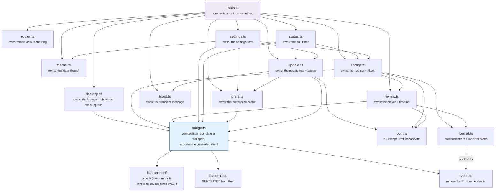
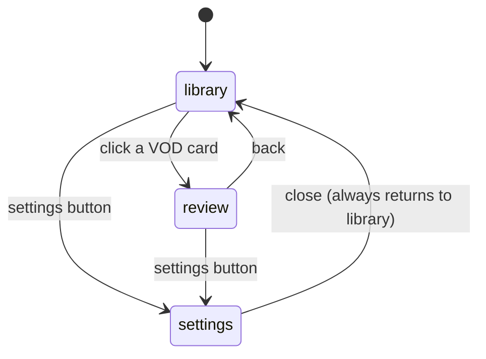
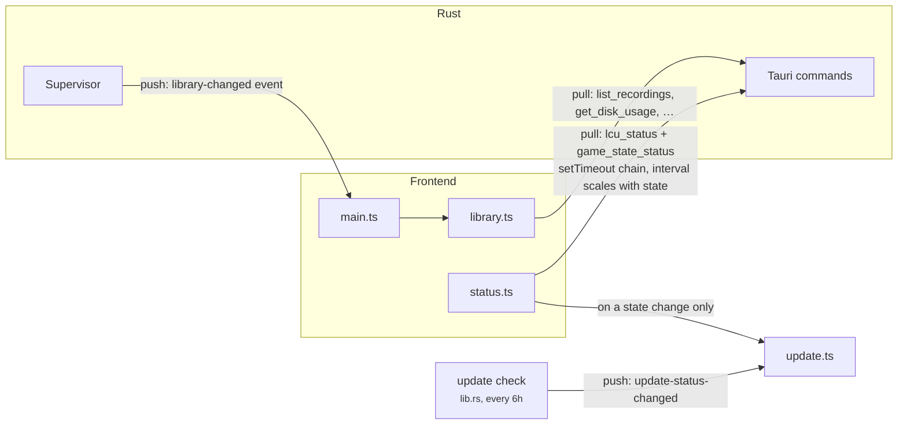
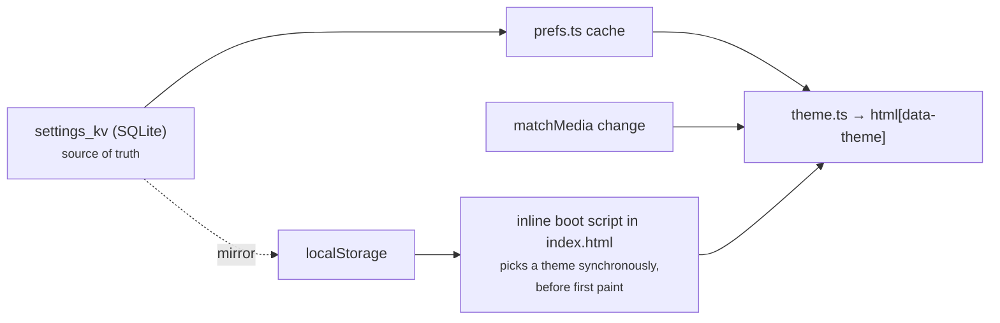

# Frontend

Vanilla TypeScript, no framework, no build-time templating beyond Vite. The
markup lives in `index.html`; the modules under `src/` wire behaviour onto it.

The organising principle is **state ownership, not widgets**. Each module owns
exactly one piece of mutable state and is the only place that writes it.

---

## Module graph



`types.ts` sits apart deliberately: putting each shape beside its first
consumer would make `bridge` → `review` → `bridge` a cycle.

`devportal.ts` is left off the graph: it is one button and a probe, and it is
compiled out of what it talks to. Its edge to `bridge.ts` is the same
`hasDevCommands` one `desktop.ts` draws.

### How a command reaches the backend

Since WS2.6 `bridge.ts` is a composition root rather than an implementation. It
picks a transport and exposes the generated client over it.

```
view  ->  client (generated)  ->  Transport  ->  invoke("rpc_call", …)  ->  daemon
                                            ->  fixtures                    in the vite dev server
```

**The transport is an interface with three implementations, and the live one
changed under every caller without one of them noticing.** `pipe.ts` is what a
Tauri session uses since WS3.4: commands go to `rpc_call`, which forwards them
over the pipe to the daemon, and the short direct-command list stays here for
the ones that drive the desktop shell. `mock.ts` is in-memory. `invoke.ts` is
the old Tauri transport, which ran commands in the process hosting the webview;
nothing selects it any more, and it is kept because it is still the correct
transport for a process that owns its own `Ctx`.

That swap is the whole argument for having put an interface at this seam before
the daemon needed one. The views, the generated client and `call` are unchanged
by it.

**`pipe.ts` also carries the other direction**, which `invoke.ts` never had to.
`subscribe` listens on three channels: `snapshot` replaces the frontend's world
on every handshake, `event` updates it, and `daemon-health` says whether there
is a connection at all. A snapshot is not an event and they are deliberately not
one channel: folding a fresh world in as though it were an update would merge it
into a stale one.

**The mock is a transport now, not a branch inside `call`.** It used to be two
thirds of `bridge.ts`, reachable only by being outside Tauri with
`import.meta.env.DEV` set. As a transport a test picks it explicitly, which is
what lets Vitest drive the *real* generated client with neither a daemon nor a
WebView2 behind it. It still tree-shakes out of a production build, because
`import.meta.env.DEV` is statically false there.

**`call` survives, deliberately.** The nine view modules are written against
it, and WS2.6's exit criterion is that frontend behaviour does not move, so
rewriting all of them was not this task. New code should prefer `client`, whose
method names, arguments and return types come from the Rust declaration; `call`
is what WS4 strangles as each view is rewritten.

### Suppressed browser behaviour

`desktop.ts` is the only module that exists to make things *not* happen. A
webview arrives as a page, with selectable text, a browser context menu, drag
images and F5, and a window wants none of it. What each half handles:

| Behaviour | Where | Exemption |
|---|---|---|
| Text selection | `styles.css`, `user-select` | Form fields, `code`, `.mono`, `.about-list dd`, and anything marked `.selectable` |
| Context menu | `contextmenu` | Text fields (it is the Cut/Copy/Paste menu there); every build that can inspect |
| Drag images | `dragstart` | Text fields |
| Middle-click autoscroll | `mousedown`, button 1 | none |
| Reload (F5, Ctrl+R) | `keydown` | Every build that can inspect |
| Print (Ctrl+P) | `keydown` | none |

"Every build that can inspect" means the vite dev server (`import.meta.env.DEV`)
or a `devtools` build, detected through `bridge.ts`'s `hasDevCommands` probe.
The flag is read when the event fires, not captured at init, so the few
milliseconds before that probe resolves simply behave like a shipped build.

The dev portal (`dev.html`, `src/dev/`) does none of this. It is a debugging
surface: log output and query results are there to be selected and copied, and
"Inspect element" is a feature of the window.

The reasoning behind all of it is in
[DEVELOPMENT.md §5.1](../DEVELOPMENT.md).

### The library is a list, not a grid

One row per game. A library is scanned rather than browsed. The question is
almost always "which game was that", answered by champion, result and roughly
when, and a card grid answers that in two dimensions when one would do. Rows
also left somewhere for the scoreboard, items and team compositions to go
without a second redesign (#85), which is where all three now are.

**A stacked block on the left sets the row's height**: what the game was, when
it was, which patch, how long it ran, and how it went. Four short lines rather
than four columns, because none of them is a number worth comparing down the
list. Together they answer "is this the game I mean", which is read once per
row and then never again.

What *is* worth comparing gets a column: the champion, and the KDA. Deaths are
coloured and the slashes are not, so the eye lands on the middle number without
having to read the other two.

Every column is *capped*, so values line up down the list and a column can be
read vertically without the eye re-finding it on each row. Cells ellipsize
rather than widening the row.

**The leftover width collects in one place, before the actions.** A single
column at `1fr` stretched the champion cell across half the window and threw
everything else at the right edge, so the row read as two unrelated clusters
with a hole between them. With every data column capped they stay one group at
the left, the actions stay pinned right, and the slack sits between them.

The team compositions were once earmarked for that slack and took a column of
their own instead. A fixed grid of squares dropped into a `1fr` track leaves
the leftover width *inside* a data column, where it is invisible to read but
real to every column added after it; slack that stays slack keeps the rule
above true rather than nearly true.

**The lane matchup, not the lobby.** The row shows the one opponent who
played your position, with their champion, their line and their build, where it
used to show all ten portraits. Ten champions told you who was in the game;
one tells you who you actually played against, which is what a person is
reconstructing when they scan a library. "The Darius game" is a matchup, not a
lobby. The other nine are still in `scoreboard_json` for anything that wants
them.

**The opponent is looked up, never guessed.** Every player on the board carries
a `position`, so the enemy in our lane is a filter rather than an index into a
list whose order nothing promises. Where the position is missing, which covers
every recording made before the field existed and any mode with no positions to
assign, there is no matchup, and the block **says so in words**. Seven blank
boxes beside a "vs" read as art that failed to load, which is a bug report
waiting to happen; "No matchup recorded" reads as what it is. The block keeps
its width either way, so the columns on both sides stay put.

**The position has to survive the LCU rebuild.** The deferred patch replaces the
live scoreboard with the LCU's (#127), which is better at almost everything:
champion ids rather than display names, settled numbers rather than the last
poll. It is *worse* at position: that comes from Riot's `lane`/`role` inference
and is sometimes absent. Replacing the board wholesale therefore threw away the
positions the live capture had, and every patched recording lost its matchup.
`prefer_live_positions` keeps them, matched on team **and** champion together
since neither is unique alone; a blind-pick game can have the same champion on
both sides.

**The live value wins where both know**, which is the rule `role` has followed
all along: the inference is a fallback for a game the poller missed, never a
correction. Filling only the gaps left the quieter half of the bug in place:
an inference that confuses two lanes produces a *present but wrong* position,
the matchup then picks the enemy in the wrong lane, and the row shows a
plausible opponent who is not the one you played. An empty matchup announces
itself; a wrong one does not.

**The art tracks are stated, not `auto`.** Every `.vod-row` is its own grid, so
an `auto` track sizes to *that row's* content, and a row whose player sold an
item, or whose scoreboard is missing, computed different widths from the row
above it. The blocks are fixed grids of fixed squares internally, so the widths
were never really variable; they only looked it. Stating them is what makes a
column read down the list, which is the entire reason the row is a grid at all.

**It sheds in two stages**, because its halves are worth different amounts. The
opponent's build is the wide part, seven squares and their gaps at 166px, and
the least of what the block says; who you played and how they did survives
another 240px of narrowing. Below about 1440px the build goes, below about
1200px the rest follows. The thresholds are the row's own tracks rather than
round numbers: with the build it needs about 1430px, without it about 1180px.

### What a row says when the data is missing

Match metadata arrives from two independent sources, Live Client Data
during the game and the LCU after it (see
[recording-pipeline.md](recording-pipeline.md) §4), so a row can carry
either, both or neither. `format.ts` owns the fallback chains rather than
scattering `??` through the row template:

| Slot | Chain | Why it stops there |
|---|---|---|
| Title (`vodTitle`) | `champion` → game mode → filename | Never empty. The filename is untrusted input, so the caller still escapes it |
| Heading (`vodHeading`) | `vodTitle` + ` vs <opponent>` + the outcome word | The long form, for the review view's heading and the row's accessible name, where there is room for what actually identifies a game. Each half is added only when known, so it degrades through `Viego vs Darius`, `Viego` plus the outcome, and `Viego` alone, rather than emitting `vs undefined`. An undecided game says nothing about a result, exactly as the row's own outcome word does |
| Queue (`queueOrModeLabel`) | `queue` id → `game_mode` | `CLASSIC` renders as "Summoner's Rift", the *map*: the mode string cannot tell blind from draft from ranked, and naming one would be a guess in a slot read as fact |
| KDA (`formatKda`) | all three or nothing | A partial KDA reads as a real one. The ratio (`kdaRatio`) is a hover hint, not a fourth number in a column three numbers wide |
| Role | Live Client Data's position → the LCU's inference → `Unknown` | The live value is what the game assigned; the LCU's `timeline.lane`/`role` is Riot working it out afterwards and confuses top with jungle, so it fills a gap rather than correcting one. `Unknown` is written out rather than left blank, because a row that hides an empty slot is a different shape per recording |
| Outcome | the leading accent, plus the word on the left block's last line | Undecided rows are excluded from the win-rate tile too, so an unknown never reads as a loss; it gets the neutral edge, no wash and no word. A Win/Loss badge used to sit in its own column and was dropped as redundant with the edge; the word moved into the sub-line rather than being dropped with it, because the accent alone is colour only |
| Rank (`rankLabel`, `lpLabel`) | `tier` + `division` → the missing-value placeholder | The ladder a game was played at. That placeholder covers three different things the column cannot tell apart (a queue with no ladder, a player unranked in it, and a patch that landed too late for the reading to still describe the game) so the row does not pretend to. LP is shown only beside a tier, since a number with no scale is not a standing. Master and above have no division and are labelled with none |
| When (`formatRelative`) | relative inside a week → absolute date | "6 weeks ago" is worse than a date at that distance: nobody counts weeks, and the date is what a person searches their memory by. The absolute form is on the `title` either way |

An unrecognised queue id shows as `Queue 1234` and an unrecognised mode
shows as itself. Both are honest; neither invents a name.

### Which blanks the backfill can fill, and which are blank forever

A row made before the metadata pipeline shipped, or imported by `reconcile`
from a folder the user pointed at, starts with almost every slot missing. The
backfill (Settings → "Fill in missing match data"; mechanics in
[data-model.md](data-model.md)) fills some of that from the client's match
history. **It cannot fill all of it, and the difference is not arbitrary:** it
is exactly the line between what the game *reported afterwards* and what only
something watching *during* the game could have seen.

| Blank on the row | The backfill | Why |
|---|---|---|
| Champion, result, KDA | fills | Straight off the match-history document |
| Queue, role, patch | fills | Same document. `role` is Riot's own `lane`/`role` inference, not the live position; see the table above |
| CS | fills, with the scoreboard | Written only when there was no scoreboard at all |
| Items, spells, runes, the ten champions | fills | The scoreboard is rebuilt from the same document, so it arrives as champion *ids* rather than display names |
| The gold curve | fills **only if the recording already has samples** | The curve has to be placed in the video, and the offset for that is read off an existing sample (`sample_alignment_offset`). A recording that never had a live poller has no offset, and a guessed one would draw the right curve at the wrong times |
| Kill diff, CS diff curves | **never** | The advantage curve's other two metrics are the live poller's own arithmetic. Match history has no per-second series but gold |
| The marker timeline | **never** | Live Client Data is gone the moment the game ends, and it was the only thing that saw the events. See [DEVELOPMENT.md §3.2](../DEVELOPMENT.md) |

The last two are the ones worth knowing before running it. A backfilled
recording gets a row that reads completely and a review view that is still
half empty: the gold curve draws, the other two metrics say they have no
data, and the timeline carries no glyphs at all. That is not a bug in the
backfill; those recordings never held the events, and nothing can put them
back.

Two properties inherited from the mechanism, because they show up as
surprises otherwise. **It only ever fills**, so a value already on the row
survives a run. It matches recordings to games on the clock, and filling a
gap on a heuristic is fair where overwriting good data on one is not. And it
**refuses outright when more than one game overlaps** a recording, so a row in
a back-to-back session can come back still blank; that is the refusal working,
not a miss.

### The filter bar

Five filters and a sort, all of them (with the stats bar above them) operating
client-side over the already-fetched row set. That is fine at solo-user
library sizes and would need real pagination if that stops being true.
Champion (a search box), result and pinned-only were there first; queue, role
and patch complete the set #85 called for, and every one of them reads a
column that already exists.

| Filter | Reads | Built from |
|---|---|---|
| Champion | `vodTitle(row)` | free text |
| Queue | `queueOrModeLabel(row)` | the rows in the library |
| Role | `role` | the rows in the library |
| Result | `win` | fixed: all / wins / losses |
| Patch | `patchLabel(row.patch)` | the rows in the library |
| Pinned only | `pinned` | a checkbox |

**The three derived lists come from the data, not from a vocabulary.** Patch
is open-ended and could not be enumerated ahead of time at all. Queue ids are
a table `format.ts` only partly names, and `Queue 1234` is a real label a
hard-coded list would have no entry for. And a fixed list offers "Ranked Flex"
to somebody who has never queued it, which is a control that can only ever
empty the list. A facet with fewer than two things to choose between is
`disabled` rather than hidden, so the bar keeps one shape as a library grows,
unless it is the facet currently filtering, which is never disabled:
retention or a delete can take the library down to the one value already
selected, and greying the control there strands a selection with no way to
undo it.

They are derived from the **whole** library, not from what the other filters
leave. Facets that narrow as you use their neighbours are how a person ends up
holding a selection they can no longer see the way out of.

**Queue filters on the label, not the id**, because the label is what the row
shows, and it is the merged `queue`-then-`game_mode` chain, so a row with no
queue id still files under what it says. Two ids that print the same name
(1700 and 1710 are both "Arena") group together, which is the intent.

**"Unknown" is a value you can filter *to*,** offered only when something is
actually missing it. "Which of my games never got a role" is the question the
`Unknown` on the row itself prompts, and the backfill leaves plenty of them.
See [data-model.md](data-model.md) for what it can and cannot fill.

**An empty result says which kind of empty it is.** "Nothing recorded yet" and
"everything is filtered out" are different problems with different next steps,
and the first message used to be the only one there was, which read as data
loss the moment a filter matched nothing. The filtered case names the total it
is hiding and carries the Clear filters button, which resets the five filters
and deliberately leaves the sort alone: sort hides nothing, and resetting it
would throw away an order the user chose.

## Views

Three top-level sections in one document, toggled by `router.ts`. Before it
existed, each view flipped its own and its sibling's `hidden` attribute from
two files that knew nothing about each other.



### The timeline stays above the fold

The review view is a page that scrolls, but the ruler under the advantage
curve is not optional furniture: it is how a position in the game is read off
the timeline at all, and having to scroll to it defeats the widget.

So the player is capped, and **the cap is a `max-width`, not a `max-height`**.
`.player-wrap` takes the vertical space left over after the app bar, the view
header and the whole timeline, and multiplies it by the recording's own aspect
ratio; `review.ts` publishes that ratio as `--player-ratio` on `loadedmetadata`,
falling back to the same 16/9 the video's `aspect-ratio` placeholder already
uses so the two never disagree before metadata lands.

Capping the height directly is the version that looks right and is wrong: the
element keeps its full width, `object-fit: contain` letterboxes inside it, and
resizing the window grows and shrinks black bars, which is why the original
`max-height: 60vh` was removed ([DEVELOPMENT.md §5.1](../DEVELOPMENT.md)).
Making the player narrower rather than shorter leaves nothing to letterbox.

Two details that are load-bearing rather than tidy:

- **`--player-chrome` is one number, and deliberately a little generous.** It
  is a sum of measured heights, and the app bar's is the one most likely to
  move. A rem too many costs a slightly smaller player; a rem too few puts the
  ruler back under the fold.
- **Fullscreen sets `max-width: none`.** The cap is about clearing a fold, and
  fullscreen has neither a fold nor a timeline beneath it; left on, it would
  clamp the video to a fraction of the screen.

On a tall window the cap never binds, because the content column's own width is
the smaller of the two, so this changes nothing for anyone who was not scrolling
in the first place.

### The player clips both ends

A recording brackets the game: it starts on the loading screen, twenty
seconds of a static splash, and it keeps rolling after the game window is
gone, which under WGC captures as *black*, not as a frozen last frame. Opening
a VOD used to land on the first, and playing one to the end used to land on
the second.

The review view treats the recording as a window instead,
`[game start − 1s, game end + 2s]`. Playback opens at its start, stops at its
end, the scrubber spans it, the ruler reads 0:00 at its start, and every seek
is clamped into it by a single `seekTo`.

**The file is untouched.** Both numbers come from the samples the timeline
already fetches: each carries a game clock and a video clock, so the offset
between them is the loading screen, and the last sample is the last thing the
game reported. No column, no migration, and it works on recordings made long
before this existed.

**Three ways it declines to clip the tail**, each falling back to the end of
the file rather than to a guess:

| Condition | Why |
|---|---|
| No samples | A rescan import, or a game whose poller never came up. Nothing knows where its game ended |
| Tail shorter than `MIN_TRIM_S` (3 s) | Not worth rewriting a gigabyte for. The tail margin is zero (DEVELOPMENT.md §5.4), so this is the only thing that keeps a short one |
| Gap wider than `MAX_TAIL_CLIP_S` (60 s) | Not a post-game tail. A stretch of unreadable Live Client Data responses keeps recording and produces *no samples*, so real gameplay would sit after the last one, and cutting there would hide the game |

Playback is stopped at the window end from both the rAF loop and
`timeupdate`: the loop is smooth but only runs while frames are produced,
`timeupdate` fires at ~4 Hz regardless. Whichever arrives first wins.

See [DEVELOPMENT.md §5.4](../DEVELOPMENT.md) for why the file is not cut, and
[#120](../../issues/120) for cutting the tail out of it.

### Where each kind of art comes from

| Kind | Source | Keyed by |
|---|---|---|
| Champion | Data Dragon | display name → key (`Wukong` → `MonkeyKing`) |
| Item | Data Dragon | the numeric id the game reports |
| Rune | Data Dragon | rune or tree id → an icon *path*, from an unversioned part of the CDN |
| Summoner spell | Data Dragon | display name *and* numeric id → art key (`Flash`, `4`, `74`, `2202` → `SummonerFlash`) |

Spells are the odd one out because `summoner.json` lists one entry per
game-mode *variant* rather than one per spell: `Flash` is `SummonerFlash`,
`SummonerFlash_Jade` and `SummonerCherryFlash`. `spell_art_map` collapses each
name onto the standard version, and maps every variant's id onto it as well, so
a live-captured scoreboard and one rebuilt from match history draw the same
picture from one cache file. Smite is folded the same way, since the jungle item
renames it `Primal Smite` mid-game and Data Dragon has no such entry. See
[DEVELOPMENT.md §5.3](../DEVELOPMENT.md).

### Art is asked for once per page, not once per icon

A row carries a champion portrait, two summoner spells, two rune icons, seven
item slots and ten more champion squares for the two team compositions. Forty
rows is therefore several hundred icons, and one IPC call each, every one a
CDN round trip the first time, would be a library that renders over several
seconds.

The team squares are the one set bounded by the *game* rather than by the
library: there are about 170 champions, a square is around 7 KB, and a library
of any size converges on the ones its owner actually meets. Ten times the names
asked for is not ten times the disk.

So `icons.ts` collects what the visible rows want, asks once (`resolve_icons`),
and caches the answer for the session. Misses are cached too: a champion Data
Dragon has never heard of must not be asked about again on every render.

`fillInArt` walks the rows eight at a time and paints each chunk as it lands,
so the top of the list fills in while the bottom is still resolving. The
backend fans out within a chunk as well, six icons at a time; see
[DEVELOPMENT.md §5.3](../DEVELOPMENT.md).

**The row is correct before any of it arrives.** Slots render empty and are
filled in afterwards, which is also exactly what an offline session gets
forever. The row still says the champion, the KDA, the CS and the result in
words. Nothing about the layout depends on a picture turning up.

Empty slots hold their place rather than collapsing. A build with four items is
a different thing from a game with no scoreboard, and a strip that shrank to fit
would say neither.

The spell-and-rune block fills **down each column** rather than across each row:
spells on the left, runes on the right, which is how every scoreboard in the
game arranges them. The markup order is therefore load-bearing: spell 1, spell
2, keystone, secondary tree.

The team block fills the other way, across each row, for the same reason: a
team is a line of five, so the line has to be what the eye picks up. Filling by
column there would interleave the two sides.

### The cluster tooltip stays inside the timeline

Hovering a glyph lists the markers it collapsed. Two things keep that list from
escaping the window, and neither can be expressed in CSS alone.

**Horizontally it is clamped in pixels.** `left` used to be the glyph's own
percentage, which with `translateX(-50%)` put half the box outside the track
for any glyph near either end, and the page grew sideways to contain it, so
the window became scrollable. `placeTooltip` clamps to the tooltip's offset
parent instead, which needs the *rendered* width and therefore has to run after
the content is in. A tooltip wider than the timeline is pinned left rather than
centred, because the start of a marker list is the part worth reading.

**Vertically it is capped and scrolls.** A dense teamfight clusters into a list
long enough to run off the top of the window. Past the cap it scrolls rather
than truncating: every marker in a cluster is one the user asked about by
hovering it.

That scroll costs something, and the cost is why `pointer-events` is
conditional. The tooltip overlaps the top of the track, so making it hoverable
unconditionally would put a dead strip over the glyphs beneath it. It takes the
pointer **only when the content actually overflows** and there is a scrollbar
worth reaching, and `hideClusterTooltip` then has to let the pointer move into
it, since leaving the glyph is what normally dismisses it and the tooltip is not
inside the glyph container.

### What a marker says

Two shapes, and the split is about who the marker is *about*.

**Kills name people**: `Killed Nautilus`, `Killed by Akali`, `Blitzcrank killed
Jarvan IV`. The name is the whole content: it is never yours, and it is what
you would scrub for.

**Objectives name nobody**: `Dragon`, `Baron`, `Herald`, `Turret`,
`Inhibitor`, `Ace`, `First Blood`. `classify_event` only writes one of these
when you took part. Every objective branch is gated on `took_part()`, and
`Ace` and `FirstBlood` on it being *you*, so the killer was always you or an
ally you assisted. Printing it told you your own champion's name, which is the
one thing you already know.

The elemental dragon type went the same way. It says which drake, not which
moment, and `Fire Dragon` followed by a champion name was four words to say
`Dragon`. **Elder is the
exception** and stays `Elder Dragon`: it is a different objective rather than a
flavour of the same one, and it is a thing you would go looking for by name.

`(stolen)` survives on the three it can apply to, because a stolen Baron is the
moment, not a detail.

### An event carries two clocks, and both are shown

Every marker stores `game_time_s` and `video_time_s`, and the event list and
the timeline tooltip print both: the game clock first, the position in the
recording after it in the subtler colour.

They are not the same fact twice. **The game clock is what the event *is*:**
Live Client Data's own number, recorded as the event arrived, and the one a
person says out loud, as in "Baron at 24:30". **The video time is derived**,
being `game_time_s` mapped through whatever alignment was in force at the time,
with a fallback for a marker seen before the game clock ever moved (see
`PendingMarker::resolve`, and [recording-pipeline.md](recording-pipeline.md)
for why the mapping happens at finalize rather than at ingest). It is the half
that can be wrong.

That is why both are shown rather than the more meaningful one alone. A
recording brackets its game, opening on the loading screen, so the two
never agree, and the gap between them *is* the lead-in. It is also the only
place a bad alignment is visible from the UI: a kill the list calls 24:30 that
seeks to black is a story the two numbers tell together and neither tells
alone. The Diagnostics panel names an unproven alignment
([dev-portal.md](dev-portal.md)); this is what it looks like from the front.

The game clock's colour is scoped to the list. The timeline tooltip is a fixed
dark surface in both themes with a palette of its own, and the page's muted
grey, chosen against a light background, disappears into it; scoped, the
tooltip's copy simply inherits the tooltip's own text colour.

## Backend communication

Two directions, deliberately asymmetric.



**Pull for live state.** The header's summoner/phase/recording readout comes
from a `setTimeout` chain, not `setInterval`: `lcu_status` reads a lockfile
and makes two HTTPS round trips, and a slow tick under `setInterval` would
stack calls on top of each other. The interval scales with game state, and
stretches to 10 s while the window is hidden.

Because that delay is only chosen when the *next* timer is armed, a
`visibilitychange` listener re-polls immediately when the window comes back.
Otherwise the header could show up to 10 s of stale state while the in-flight
timer ran out. The 60 s safety refresh is skipped entirely while hidden: it
rebuilds the whole grid with `innerHTML`, and `library-changed` already covers
real changes. Skipping it leaves its timestamp stale on purpose, so the first
poll after the window returns catches up at once.

**Push for the library.** `library-changed` is one of two backend→frontend
events: the supervisor emits it after a finalize, and `set_retention_policy`
after a deletion. Polling `list_recordings` instead would rebuild the grid
every few seconds and fight scroll and focus.

**Push for updates.** `update-status-changed` is the other. The background
check runs every six hours ([DEVELOPMENT.md §14](../DEVELOPMENT.md)), which is
far too slow to poll for. But *whether the offered update can be installed*
depends on game state, which changes constantly. So `status.ts` also nudges
`update.ts` on a state **edge** and not every tick: without it the Install
button would sit enabled through a whole game and only refuse at the click.

**The release notes are built as nodes, never as markup.** `latest.json` is
fetched over HTTPS but is *not* covered by the update signature; only the
installer it points at is. So everything in the notes is remote text the app
did not write. `renderNotes` therefore drops the `## What's changed` heading,
turns `- ` lines into a list, and makes a paragraph of anything else, with
every string reaching the DOM through `textContent`.

The one exception is emphasis, and it is an exception in *parsing*, not in
trust. GitHub's generated notes end with `**Full changelog**: <url>`, which a
pure-`textContent` paragraph rendered with its asterisks showing. `inlineNodes`
splits those runs into `<strong>` elements built with `createElement` and
filled with `textContent`, so nothing from the manifest is ever interpreted as
HTML. Emphasis is the only inline syntax the notes contain, so it is the only
one handled. An unclosed `**` matches nothing and the line shows as written,
which is the same "shown rather than swallowed" rule the line types follow.

### Command surface

The names and arguments below are the IPC contract and have not changed, but
how they reach Rust has. `bridge.ts` sends all but three of them through a
single `rpc` command, `invoke("rpc", { command, args })`, which `core`'s
dispatch table routes by name
([DEVELOPMENT.md §12](../DEVELOPMENT.md#12-process-model-a-recorder-daemon-and-a-ui-that-can-leave)).
Callers are unaffected: `call()` takes the same name and the same args object,
and forwards the args untouched.

The exceptions are in `DIRECT_COMMANDS` in `bridge.ts`:
`open_recordings_folder` and `dev_open_portal` drive the desktop shell, so they
stay in the UI process; `dev_registered_commands` must stay direct because
`devportal.ts` detects the portal's existence by watching that call *reject* in
a shipped build.

> **`src/types.ts` is no longer the source of truth either.** Since WS2.2 all
> 37 types crossing the boundary derive `ts_rs::TS` beside their serde derives,
> and WS2.5's generator emits the TypeScript from those. The hand-written
> interfaces in `src/types.ts` are what that replaces.
>
> They agree today, checked rather than assumed: the generated `RecordingRow` uses
> `number` for every `i64`, which is what this file has said since v1 and what
> `JSON.parse` actually produces. ts-rs's *default* would have said `bigint`,
> which JSON cannot carry at all; `contract::types::config()` is where that is
> corrected and a test pins it.

> **This whole table is now generated, and `src/lib/contract/` is the output.**
> Since WS2.5 `cargo run --bin gen-contract` emits `types.ts`, `client.ts`,
> `events.ts` and a barrel from the Rust declaration, and CI runs the same
> binary with `--check`, so a command added without regenerating cannot merge.
> The generated files are committed, which is what lets a frontend developer
> work without a Rust toolchain and makes a contract change reviewable as a
> diff. Biome does not format them: a formatter rewriting a generator's output
> is a loop.
>
> There is deliberately **no Rust-to-TypeScript type map in the generator**.
> The macros resolve the names where they still hold the real types, so
> `dispatch_table!` emits a manifest whose types are already rendered and every
> boundary type answers `ts_rs::TS::decl`. A third list able to disagree with
> the other two is the thing this workstream exists to delete.
>
> The generated client's **method name is the wire name**, `list_recordings`
> rather than `listRecordings`. Only the *arguments* are camelCased, because
> that is the only rename serde actually performs, and camel-casing the method
> too would add a second mapping to keep in step.

> **The `Returns` column is no longer the source of truth.** Since WS2.1 every
> row of `dispatch_table!` declares its own return type, and the compiler checks
> the declaration against the function, so a wrong one is an `E0308` at the `?`,
> not a silent disagreement. `core::dispatch::contract_manifest()` is where that
> lives now, and WS2.5's generator emits the TypeScript from it.
>
> This table survives because it carries the one thing the manifest does not:
> **which part of the UI uses each command.** Keep that column accurate. If the
> `Returns` column and the manifest ever disagree, the manifest is right, and
> WS2.5 deletes this column rather than fixing it.

| Command | Returns | Used by |
|---|---|---|
| `list_recordings` | `Vec<RecordingRow>` | library grid |
| `rescan_recordings` | `ReconcileReport` | library toolbar → rescan |
| `backfill_match_metadata` | `BackfillReport` | settings → storage → fill in |
| `resolve_icons` | `IconSet` | library row art, after the list paints |
| `get_recording_markers` | `Vec<MarkerRow>` | review timeline |
| `get_recording_samples` | `Vec<SampleRow>` | advantage curve |
| `get_disk_usage` | `DiskUsage` | library stats bar |
| `get_retention_policy` / `set_retention_policy` | policy / `EnforcementReport` | settings → storage |
| `preview_retention_policy` | dry-run deletion list | settings, while editing |
| `set_pinned` | nothing | library 📌 |
| `delete_recording` | nothing | library card |
| `get_recordings_dir` / `open_recordings_folder` | path / nothing | settings |
| `get_ui_prefs` / `set_ui_pref` | `HashMap<String,String>` / nothing | `prefs.ts` |
| `get_autostart` / `set_autostart` | `AutostartStatus` | settings → background & tray |
| `get_audio_preset` / `set_audio_preset` | `AudioPreset` / nothing | settings → audio |
| `list_audio_inputs` | `Vec<AudioInputDevice>` | settings → microphone picker |
| `extract_audio_track` | path to a cached sidecar | review player, stem selection |
| `lcu_status` | `LcuStatus` | header strip |
| `game_state_status` | `SupervisorStatus` | header strip, About block |
| `dev_open_portal` | nothing | the header's dev button, and the 🔎 on each library row (which passes a `recordingId` so the portal opens on it) |
| `get_update_status` | `UpdateStatus` | settings → About (version + changelog), and the badge on the gear |
| none | the `updateChannel` pref | the channel dropdown rides `get_ui_prefs`/`set_ui_pref`, so it needs no command of its own |
| `check_for_update` | nothing | settings → About → "Check now" |
| `install_update` | nothing | settings → About → "Install and restart"; ends the process |
| `start_recording` / `stop_recording` / `is_recording` | nothing | registered but unreferenced by the main UI; the dev portal's Recorder panel drives them |

**Start on login is the one setting that is not a pref.** It lives in the
platform's own store (`HKCU\…\Run` on Windows) which the user can also edit
from Task Manager, so `settings.ts` reads it from `get_autostart` when the view
loads instead of from the `prefs.ts` cache, and applies whatever
`set_autostart` reports *back* rather than the value it just sent
([DEVELOPMENT.md §12](../DEVELOPMENT.md#12-process-model-a-recorder-daemon-and-a-ui-that-can-leave)).
It is the only row in the settings form that can come back disabled, when the
build has no autostart control or the read failed.

### Event surface

The other half of the contract, and the half v1 never declared. Commands are
the UI asking; events are the daemon telling. Until WS2.3 the second kind
existed only as string constants at each `Emitter::emit` call site
(`LIBRARY_CHANGED_EVENT`, `UPDATE_STATUS_EVENT`), mirrored by hand in
TypeScript.

`contract::events`'s `contract_events!` table is now the single declaration.
Each row is `Variant { field: Type, … } => Topic`, and the enum, `topic()`,
`event_names()` and `event_manifest()` are all generated from it, so a variant
cannot be added without a topic, because that is a syntax error rather than a
convention.

> **Appendix B calls this "a small derive"; it is a `macro_rules!` instead.** A
> real derive needs a proc-macro crate, which would mean making `src-tauri` a
> workspace and taking `syn`, `quote` and `proc-macro2` to produce output a
> declarative macro produces already. `dispatch_table!` is the precedent: it
> declares the command half and emits its manifest beside it. The plan's output
> is unchanged; only the mechanism is.

Events are internally tagged, so one arrives as
`{"type":"stateChanged","state":"Recording","sinceMs":…}` and a generated
client gets a discriminated union it can switch on exhaustively.

**A client subscribes by topic, never by event name.** That is what lets a
variant be added to an existing topic without a client change.

| Topic | Carries | Subscribed by |
|---|---|---|
| `recording` | `StateChanged`, `RecordingStarted`, `RecordingStopped`, `MarkerAdded`, `SampleBatch` | main UI, dev portal |
| `lcu` | `LcuPhase` | main UI, dev portal |
| `library` | `LibraryChanged`, `MatchSummaryPatched`, `RetentionRan` | main UI, dev portal |
| `update` | `UpdateStatus` | main UI, dev portal |
| `daemon` | `DaemonShuttingDown`, `Lagged` | dev portal; the transport handles `Lagged` itself by re-`hello`ing |

Three details are load-bearing:

- **`SampleBatch` is a batch on purpose.** A 35-minute game produces about
  2,000 advantage samples, and 2,000 notifications is a frame-rate problem in
  the UI for data drawn as one line.
- **`recording_id` is `Option<i64>` while a game is in flight.** The library
  row is written at finalize, so nothing has an id until then; a client
  correlates on `RecordingStarted.file_stem` until `RecordingStopped` names the
  row. That field is the stem rather than a path because `Recorder::start`
  returns `Ok(())`, so the file it wrote, extension included, is only known when
  `stop` returns.
- **`LcuPhase.phase` is `None` exactly when no client is running**, which is a
  different statement from `GameflowPhase::None`, which is a client sitting at
  the front page. A test pins the two apart.

**Q7 is answered by the code rather than left open.** Issue #73 asks whether
`LcuPhase` carries the full `gameflow-phase` enumeration or "the subset
`lcu/gameflow.rs` models today". There is no subset: `GameflowPhase` already
names all fourteen phases the LCU defines and carries `Unknown(String)` for
anything a client update invents. The state machine *consumes* a subset, in
that `is_game_running_phase` matches two variants, but that is a reader
narrowing a full type, not a narrow type. So the event carries it whole.

### What emits them

`Supervisor::set_event_sink` installs the sink, from `lib.rs` and for the same
reason `set_event_notifier` is installed there: `run()` is dead code in a `cargo
test` build and gets stripped, which is what keeps Tauri's Wry window machinery,
and the whole Win32 GUI import stack behind it, out of the test binary. The
sink is a type-erased boxed closure, never an `AppHandle`
([supervisor.rs](../src-tauri/src/state_machine/supervisor.rs)'s `on_event`
comment records what happens when that rule is broken: the test binary died at
load with `STATUS_ENTRYPOINT_NOT_FOUND` before running a single test).

Everything goes out on one Tauri event, `event`, because the contract's own
discriminant is `type` and that is what a client switches on. The v1 channels
(`library-changed`, `update-status-changed`) still fire beside it; WS2.7 deletes
them.

| Event | Emitted from | Wired |
|---|---|---|
| `StateChanged` | `dispatch_one`, on transitions that actually move | yes |
| `LcuPhase` | the gameflow watcher, and `stop_gameflow_watch` for `client_present: false` | yes |
| `RecordingStarted` / `RecordingStopped` | `start_recording` / `stop_recording` | yes |
| `MarkerAdded` | `on_snapshot`, one per marker a poll produced | yes |
| `LibraryChanged` | `emit_library_changed` | yes, `Finalized` and `Edited` |
| `RetentionRan` | the post-finalize enforcement pass | yes |
| `UpdateStatus` | `record_update_result` in `lib.rs` | yes |
| `SampleBatch` | nothing yet | no: the 5 s window needs a *subscriber* to batch for (WS2.6) |
| `MatchSummaryPatched` | nothing yet | no: published from the `library-changed` site still in `lib.rs` |
| `DaemonShuttingDown`, `Lagged` | nothing yet | no: they describe a daemon and a broadcast buffer WS3 builds |

Declaring the unwired four is the point rather than an oversight: the contract
is what the surface *is*, not what happens to be connected. They carry
`cfg_attr(not(test), allow(dead_code))` meanwhile, as `CLAUDE.md` describes.

**`SupervisorEvent` is not a second declaration of the wire.** It is internal:
it triggers desktop notifications and the v1 `library-changed` push, it carries
what a toast needs to describe itself, and it is deliberately absent from
`contract::types`' boundary list because it never crosses IPC. One declaration
of what crosses, one internal callback for what does not. WS3 folds them
together when notifications move into the daemon.

**A marker published live is provisional.** `video_time_s` comes from the
alignment known at that poll, and a later poll can improve it, so a marker on
the wire mid-game can sit a fraction of a second from where the same marker
lands in the database, which resolves every marker against the final alignment.
The live value draws a timeline while the game runs; the row is what the library
reads.

### The snapshot, and why it is not a replay

Commands answer questions and events announce changes, which leaves one gap: a
client that has just connected knows nothing, and a client that reconnects after
a dropped pipe knows something out of date. `contract::snapshot::Snapshot` is
the answer to both. A client gets exactly one, then a stream of events, and it
**never replays history**. There is no backlog to drain, so there is no way to
be subtly behind.

| Field | Kept current afterwards by |
|---|---|
| `state` | `StateChanged` |
| `lcu` | `LcuPhase` |
| `currentRecording` | `MarkerAdded`, `SampleBatch` |
| `update` | `UpdateStatus` |
| `prefs` | nothing; the UI writes these and owns the echo |

The snapshot and the event surface describe the same state deliberately. A
field with no event would go stale without saying so, and an event with no
field would leave a reconnecting client with no baseline to apply it to.

**`seq` positions it in the stream.** An event numbered at or below it is
already reflected in the snapshot and is dropped; the first event a client
applies is `seq + 1`. Without that, a snapshot assembled while events were in
flight would be applied over newer state. The counter belongs to the transport
(WS3.1), so `assemble` is handed one rather than inventing it.

**`lcu` is handed in for a sharper reason.** `core::lcu_status` is async,
discovers the lockfile itself and makes two HTTPS round trips; its own doc calls
it a smoke test. Putting that on every connect would make the handshake cost a
network request, and would re-derive what the state machine already knows from
`lcu::gameflow::watch`.

**`state` is the bare `GameState`, not `SupervisorStatus`.** The latter also
carries `last_finalized`, which is a whole recording including every marker of
the last game. A message sent on every connect must not grow with the length of
a game, and "what did the last game produce" is a library question that
`list_recordings` and `get_recording_markers` already answer. What is live
rather than stored is in `currentRecording`, which carries the file stem, the
running marker and sample counts, and the alignment offset (`null` until the
game clock is first seen to advance, which is not the same as `0`).

Nothing sends one yet: WS3.1 is where a pipe exists to send it down. The type is
declared now for the same reason the four unwired events are, which the table
above records.

## Routing and the tray

`router.ts` owns which view is showing. `initRouting` adds two entry points the
tray needs: a `#settings` URL fragment read once at startup, for a window the
tray has just created, and a `navigate` event for a window that already exists.
A `#review` fragment is ignored, because the review view with no recording
loaded is not a state worth restoring into.

## Theming

`data-theme` on `<html>` is written by JS and only ever holds `"light"` or
`"dark"`, and there is no `prefers-color-scheme` query in the stylesheet.
Resolving the OS preference once, in one place, keeps a single dark block
instead of two and makes an explicit "Light" on a dark OS win by construction
rather than by CSS specificity.

The cost: "System" no longer follows the OS for free. `theme.ts` listens on
the matchMedia `change` event to put that back, and **removing that listener is a
silent regression with no test to catch it.**



`localStorage` exists for exactly one reason: the boot script has to choose a
theme before first paint and IPC resolves too late. SQLite stays the source of
truth and wins any disagreement.

## Review player

- A plain `<video>` element. H.264/AAC MP4 decodes natively in the webview, so
  seeking and playback rate come for free.
- Video loads through Tauri's asset protocol (`convertFileSrc`), scoped in
  `tauri.conf.json` to `$APPDATA/recordings/*` and
  `$APPDATA/recordings/audio-tracks/*`. This needs the `protocol-asset` Cargo
  feature, not just the config entry. The second entry is not redundant:
  Tauri's scope matcher won't let `*` cross a `/`.
- **The controls live inside `.player-wrap`**, over a scrim at the bottom of
  the video, not in a bar beneath it. That is not cosmetic:
  `requestFullscreen` is called on `.player-wrap`, and anything outside the
  fullscreened subtree is not rendered at all, so controls beside the video
  simply vanished when you pressed `f`. The `:fullscreen` rules in
  `styles.css` are load-bearing for the same feature: without them
  `#review-video` keeps its `max-height: 60vh` and renders as a small
  rectangle in the middle of a black screen.
- **Two seek surfaces, one implementation.** The plain progress bar inside the
  player and the rich `#vod-timeline` below it both go through
  `bindScrubbing` + `seekFromPointer`, which take the element to measure
  against. The in-player bar carries no marker ticks; the timeline keeps the
  metric graph, marker glyphs and ruler. The timeline is *outside*
  `.player-wrap`, so it is unavailable in fullscreen. There, marker
  navigation is the `[` / `]` / `d` / `D` hotkeys, which are bound at the
  document level and keep working.
- **Speed and audio-track pickers sit behind the gear button**, in a popover
  that closes on outside pointerdown, on Escape, on `fullscreenchange` and in
  `closeReview`. Escape is guarded on the menu actually being open, so it
  never shadows the user agent's own Escape-exits-fullscreen. Volume is an
  icon that expands into a slider on hover or focus, with an `.open` class
  held for the duration of a drag so it cannot collapse mid-drag.
- The fullscreen button's state is synced from a `fullscreenchange` listener
  rather than from the click handler, since Escape and the OS can both leave
  fullscreen without going through the app.
- Markers closer together than the timeline can resolve (common around a
  teamfight) collapse into one cluster glyph; `MARKER_PRIORITY` decides which
  icon the cluster shows.
- **Audio stems.** Track 0 is the combined mix and plays from the `<video>`
  itself, so most recordings need nothing here and the picker stays hidden
  (fewer than two tracks, or an unknown layout). Selecting any other track
  calls `extract_audio_track`, then plays the returned sidecar through a
  hidden `<audio>` synced against the muted video, since WebView2 offers no way
  to switch tracks within one element
  ([DEVELOPMENT.md §2.5](../DEVELOPMENT.md#25-multi-track-audio)).
- Because of that, **volume and mute are held as state, not read off the video
  element** (`userVolume` / `userMuted` → `applyAudioOutput`). The video is
  muted whenever a stem is playing, and controls that read `video.muted` would
  render a muted player over audible sound. The `volumechange` listener was
  removed for the same reason: it would re-enter on the programmatic mute.

- **Playback stops while the window is hidden.** An open VOD otherwise keeps
  decoding video and playing its stem `<audio>` behind a minimised window,
  which is the largest thing the app can burn while it is out of the way.
  A `visibilitychange` listener pauses it and resumes only what it paused
  (`pausedByHide`), so a video the user had already paused stays paused.
  Pausing cascades through the existing `play`/`pause` handlers, so the rAF
  playhead loop stops with it, and `resumeStem` hard-resyncs the stem on the
  way back, so it cannot return drifted.

## Escaping

`reconcile` imports any video file the user drops into the recordings folder,
so a displayed recording name is **not necessarily ours**. `escapeHtml` is for
text nodes and does not handle quotes; `escapeAttr` is the one for attribute
values. Using the wrong one is an injection bug with a plausible trigger.
